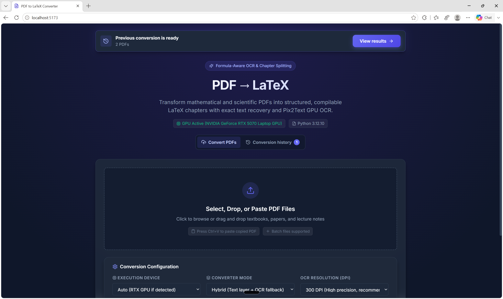
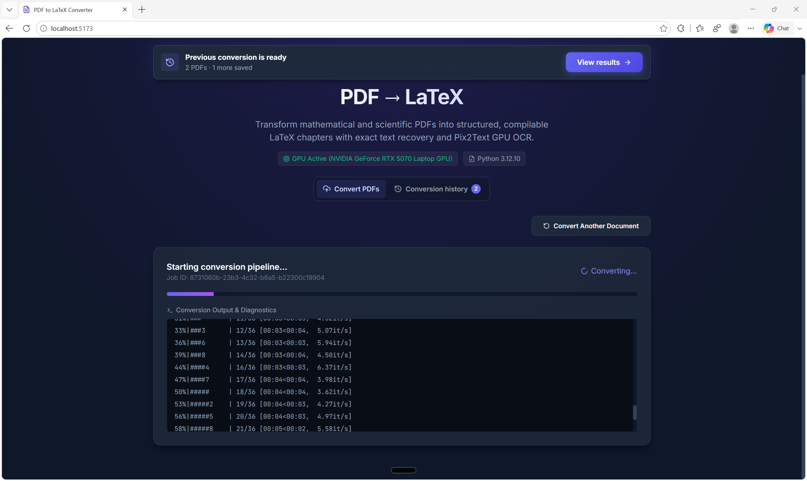
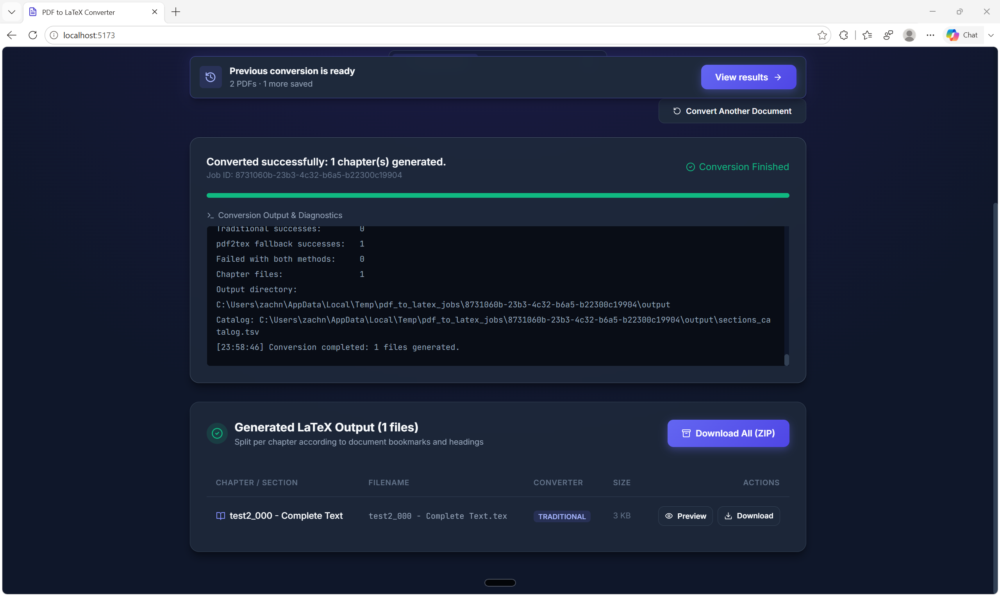
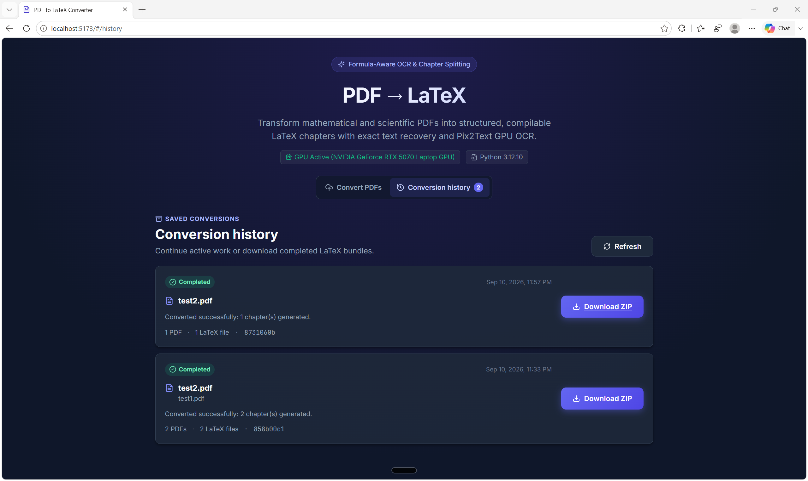

# PDF → LaTeX

An enterprise-grade, GPU-accelerated pipeline and web interface for converting complex mathematical and scientific PDFs into structured, compilable LaTeX chapters.

```text
Input: textbook.pdf  ──▶  Output:  textbook_000 - Front Matter.tex
                                   textbook_001 - 1 Probability.tex
                                   textbook_002 - 2 Distributions.tex
                                   sections_catalog.tsv
```

The system uses a **hybrid conversion strategy**:
1. **Exact Text-Layer Conversion**: Fast, exact extraction using PyMuPDF, custom font metric decoders, and structural math tokenizers.
2. **Formula-Aware OCR Fallback**: GPU-accelerated Pix2Text vision-to-sequence neural network for scanned documents, damaged text layers, or built-up mathematics.

Both routes feed into `chapter_split`, generating clean, compilable per-chapter `.tex` documents and a comprehensive `sections_catalog.tsv` catalog.

---

## Features

- **Modern React.js Web UI**:
  - Drag-and-drop file upload.
  - Native file browser selection.
  - **Clipboard Paste Support**: Copy a PDF file or binary anywhere and press <kbd>Ctrl</kbd>+<kbd>V</kbd> to paste it directly into the conversion queue.
  - Live progress tracking, stage indicators, and real-time streaming conversion logs.
  - Crash-safe recovery banner for reopening completed jobs or resuming interrupted conversions.
  - Conversion History screen with live jobs, checkpoint resume, safe discard, and ZIP downloads.
  - In-browser LaTeX code preview modal with one-click copy to clipboard.
  - Download individual `.tex` chapters or the complete bundle as a `.zip` archive.
- **Robust Python FastAPI Backend**:
  - Isolated temporary execution directories created under the operating system's temp folder (`tempfile.gettempdir()`).
  - Atomic job manifests restore conversion state and checkpoint-backed work after a backend restart.
  - Asynchronous background worker threads with thread-safe job state tracking.
  - Security measures against directory traversal attacks.
  - Automated cleanup of expired temporary jobs.
- **Standalone Command Line Interface (CLI)**:
  - Recursive folder scanning, page-level checkpointing, and resume capability.
- **Productionized Architecture**:
  - Follows Pillar 6 Secrets Detection, Redaction & Credential Hygiene with automated audit tracking in `secrets.md`.
  - Automated GPU hardware detection (NVIDIA GeForce RTX detection with CUDA 12.8 PyTorch wheels).
  - Cross-platform setup and execution scripts (`setup.bat`/`setup.sh`, `run.bat`/`run.sh`).

---

## Interface Walkthrough

### 1. Add PDFs and configure a conversion

Upload one or more PDFs by browsing, dragging and dropping, or pasting from the clipboard. The landing page reports the active compute device, exposes text/OCR conversion settings, and keeps prior work one click away.



### 2. Follow live conversion progress

While a job is running, the interface shows its current status, progress bar, and streaming diagnostic output. You can start another conversion without losing access to the active job.



### 3. Review and download generated LaTeX

Completed conversions list their generated chapters. Preview or download individual `.tex` files, or download the complete output bundle as a ZIP archive.



### 4. Reopen conversion history

The Conversion History screen retains completed, interrupted, and in-progress jobs. Resume checkpointed work, discard work you no longer need, or download the ZIP for a completed conversion.



---

## Quick Start

### 1. Prerequisites

- **Python**: 3.11, 3.12, or 3.13 (Python 3.12 recommended; PyTorch and ONNX wheels require ≤ 3.13).
- **Node.js**: v18 or later (for the React Web UI).
- **GPU (Optional)**: NVIDIA GeForce RTX GPU with CUDA 12.8 for accelerated formula OCR. Automatic CPU fallback is supported on all systems.

### 2. Automated Setup

Run the setup script for your platform:

**Windows**:
```bat
setup.bat
```
*(On Windows systems where Python 3.14+ is the default command, `setup.bat` automatically selects Python 3.12 or 3.11 via the Windows `py` launcher).*

**Linux / macOS**:
```bash
chmod +x setup.sh run.sh convert_pdfs.sh
./setup.sh
```

The setup script automatically:
1. Creates the local virtual environment (`.venv`).
2. Upgrades `pip`, `setuptools`, and `wheel`.
3. Detects NVIDIA RTX GPUs and installs the matching PyTorch (`+cu128` or CPU).
4. Installs backend dependencies and ONNX Runtime (`onnxruntime-gpu` or `onnxruntime`).
5. Validates traditional and OCR converter dependencies.
6. Installs React frontend packages (`npm install`).

### 3. Launching the Application (Web UI + Backend)

Start both the FastAPI backend and Vite React frontend with a single command:

**Windows**:
```bat
run.bat
```

**Linux / macOS**:
```bash
./run.sh
```

Once running:
- **Web UI**: [http://localhost:5173](http://localhost:5173)
- **Backend API Docs (Swagger)**: [http://localhost:8000/docs](http://localhost:8000/docs)
- **Health Endpoint**: [http://localhost:8000/api/health](http://localhost:8000/api/health)

Press <kbd>Ctrl</kbd>+<kbd>C</kbd> in your terminal to cleanly terminate both services.

---

## CLI Batch Conversion

To convert PDFs from the command line without the web interface:

**Windows**:
```bat
convert_pdfs.bat --input input/ --output output/
```

**Linux / macOS**:
```bash
./convert_pdfs.sh --input input/ --output output/
```

### CLI Options

| Option | Description | Default |
|---|---|---|
| `--input DIR` | Directory searched recursively for PDFs | `input/` |
| `--output DIR` | Directory mirroring the input structure | `output/` |
| `--device auto\|cuda\|cpu` | Compute device for OCR fallback | `auto` |
| `--dpi N` | Rendering resolution for OCR pages | `300` |
| `--min-section-chars N` | Character threshold for heading detection | `3000` |
| `--force` | Reprocess PDFs whose `.tex` already exists | `False` |
| `--traditional-only` | Text-layer conversion only (never fall back to OCR) | `False` |
| `--pdf2tex-only` | OCR conversion only (skip text layer) | `False` |
| `--verbose` | Detailed diagnostic tracebacks | `False` |

---

## REST API Endpoints

The FastAPI backend provides full programmatic control:

| Method | Endpoint | Description |
|---|---|---|
| `GET` | `/api/health` | System health, Python version, and GPU/RTX hardware status |
| `POST` | `/api/convert` | Multipart upload for PDF conversion with options (`device`, `mode`, `dpi`) |
| `GET` | `/api/jobs` | List retained conversions available for recovery |
| `GET` | `/api/jobs/{job_id}` | Job status, progress percentage, logs, and generated chapter list |
| `POST` | `/api/jobs/{job_id}/resume` | Resume an interrupted or failed conversion from its saved checkpoint |
| `GET` | `/api/jobs/{job_id}/files/{filename}` | Retrieve raw LaTeX content of a chapter (`?download=true` to save) |
| `GET` | `/api/jobs/{job_id}/download-zip` | Download complete `.zip` archive of all output chapters & catalog |
| `DELETE` | `/api/jobs/{job_id}` | Terminate job and remove temporary directories |

---

## Project Structure

```text
pdf-to-latex/
├── setup.py                  # Root environment manager (.venv, PyTorch, packages)
├── setup.bat / setup.sh      # Setup entrypoints dispatching setup.py
├── run.py                    # Process supervisor launching frontend & backend
├── run.bat / run.sh          # Execution entrypoints dispatching run.py
├── convert_pdfs.bat / .sh    # Standalone CLI conversion shortcuts
├── secrets.md                # Pillar 6 Secrets Audit verification report
├── .env.example              # Safe environment variable configuration template
├── backend/
│   ├── main.py               # FastAPI application entrypoint & CORS
│   ├── api/
│   │   ├── routes.py         # REST endpoints (convert, jobs, files, zip)
│   │   └── schemas.py        # Pydantic data schemas
│   ├── services/
│   │   ├── job_manager.py    # Temporary folder lifecycle & background worker
│   │   └── converter.py      # Adapter to pdfconv orchestrator
│   ├── convert_pdfs.py       # Core CLI script
│   ├── pdfconv/              # Core conversion engine
│   │   ├── traditional/      # Text-layer converter & LaTeX reconstructor
│   │   ├── pdf2tex/          # Pix2Text OCR model runner & recognizer
│   │   ├── chapter_split/    # Heading heuristic & bookmark chapter splitter
│   │   ├── checkpoint/       # Resumable page caches & hash verification
│   │   └── orchestrator.py   # Fallback policy & directory walker
│   ├── setup_tools/          # Hardware detection & PyTorch installation logic
│   └── tests/                # Unit test suite & API integration tests
└── frontend/                 # React + TypeScript + Vite UI
    ├── src/
    │   ├── App.tsx           # Main application UI
    │   ├── components/       # FileUploadZone (paste/select), Options, Progress, Results
    │   └── services/api.ts   # Typed API client
    ├── package.json
    └── vite.config.ts
```

---

## Running Automated Tests

Run the test suite inside the project virtual environment:

**Windows**:
```bat
.venv\Scripts\python.exe -m unittest discover -s backend\tests -t backend -v
```

**Linux / macOS**:
```bash
.venv/bin/python -m unittest discover -s backend/tests -t backend -v
```

The tests run using in-memory mock PDFs and stubbed OCR models, requiring no external network calls, GPU, or model weights.

---

## License

This project is licensed under the Apache License 2.0. See [LICENSE](LICENSE) for details.
